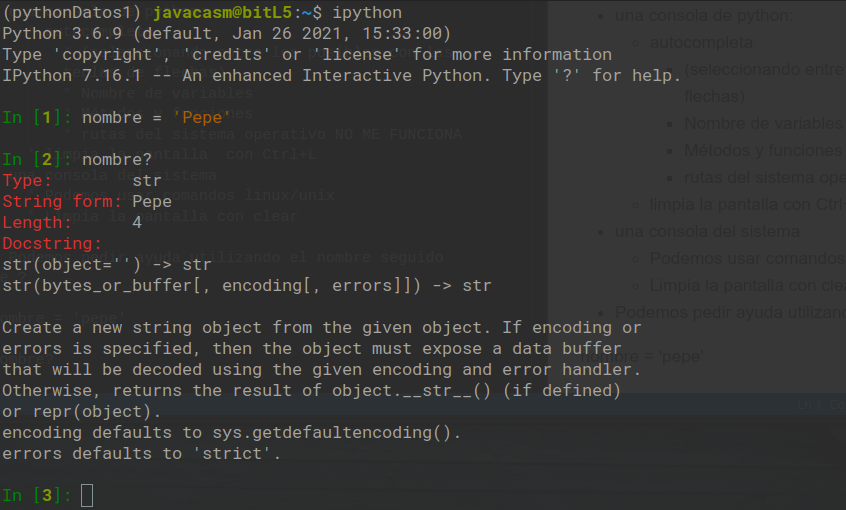
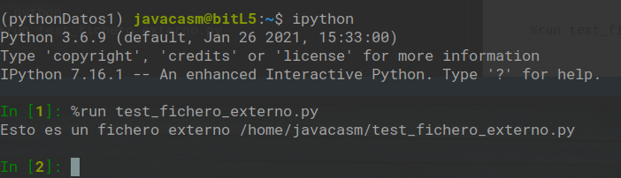

Es:

* una mezcla de python y de jupyter

* una consola de python:
    * autocompleta 
        * (seleccionando entre los posibles con las teclas de flechas)
        * Nombre de variables
        * Métodos y funciones
        * rutas del sistema operativo NO ME FUNCIONA
    * limpia la pantalla  con Ctrl+L
* una consola del sistema
    * Podemos usar comandos linux/unix
    * Limpia la pantalla con clear
    
* Podemos pedir ayuda utilizando el nombre seguido de ?

nombre = 'pepe'

nombre?



con "??" nos muestra el código fuente de la función

## Comandos mágicos

empiezan por %

## Midiendo tiempos con %time

```python
def tarea_lenta():
    import time
    time.sleep(1)
    print('estoy en la función lenta)

%time tarea_lenta()

```

## Limpiando con %reset

%reset borra todas las funciones, variables, clases, importaciones, ...
Nos pregunta y confirmamos

## Ejecutando con %run

%run hola_mundo.py

Creamos el fichero 'test_fichero_externo.py' con el contenido:

```python
print('Esto es un fichero externo ' + __file__ )
```

y desde ipython hacemos

```python
 %run test_fichero_externo.py
```



## Cargando contenido con %load

%load fichero carga el fichero y nos permite añadir código pero sin alterar el contenido original 

## Guardando nuestro trabajo con %save


%save fichero.py 2-9 

Guarda en fichero.py las líneas 2-9 que hemos hecho

O %save fichero.py 3 5 6 # guarda sólo esas líneas

Con save y load podemos continuar el trabajo por donde íbamos.

Si queremos añadir usaremos  "save -a lineas "
