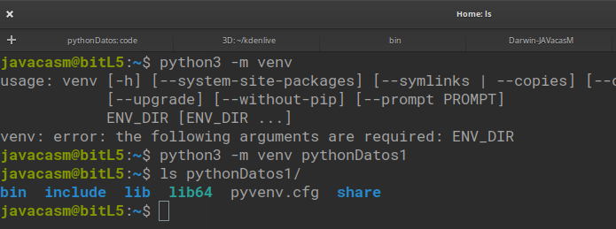
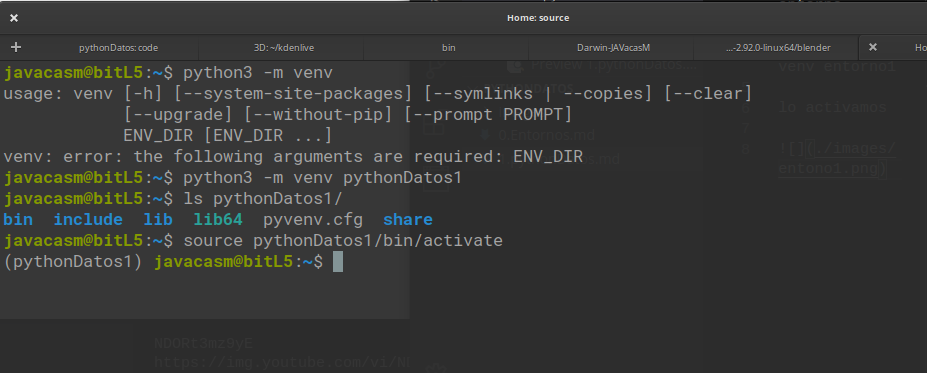
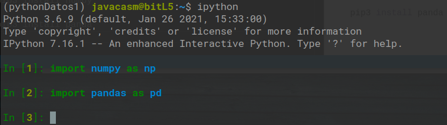
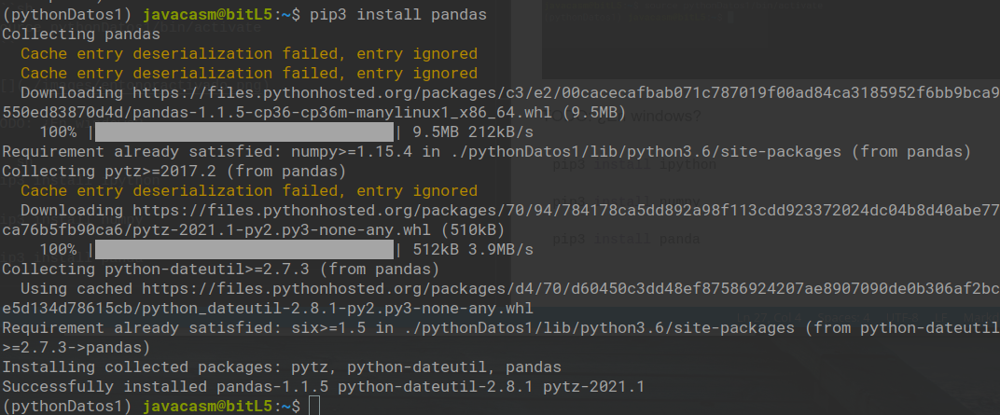
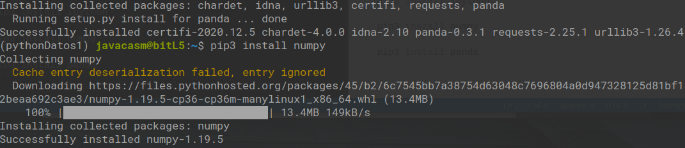

## instalación
creamos el entorno

```sh
python3 -m venv entorno1
```




lo activamos

```sh
source pythonDatos1/bin/activate
```



TODO: ¿En windows?

```sh
pip3 install ipython

pip3 install numpy

pip3 install panda
```




